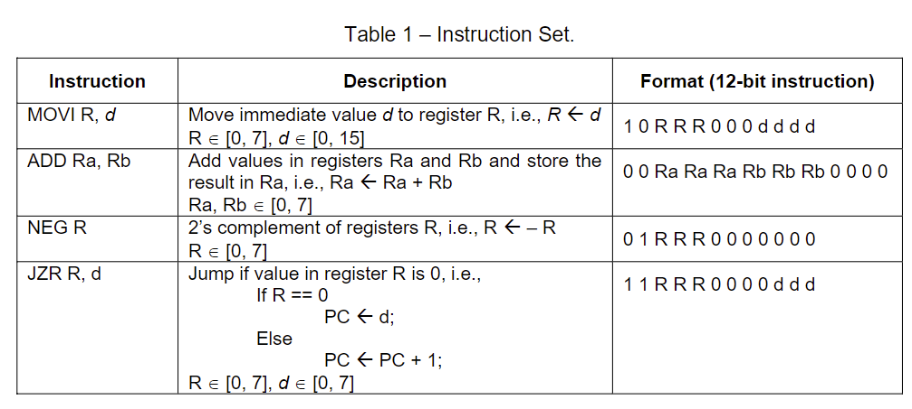

# Instruction Decoder

We need to design and build the Instruction Decoder circuit to activate
necessary components based on the instructions we wish to execute.

#### **Be careful to activate only the necessary modules** 
- While executing MOVI instruction only the required register should be enabled, and the immediate value needs to be placed on the data bus. 
- For ADD and NEG instructions, relevant inputs should be selected from the multiplexers and output should be sent to the correct register (register needs to be enabled). 
- Moreover, NEG require setting Add/Sub select.

## Inputs 
- `I(11 downto 0)` : Instruction (12 bits) 
- `RC(3 downto 0)` : Register check for Jump (4 bits)

## Outputs
- `R(3 downto 0)` : Register enable (3 bits)
- `L` Load select (1 bit)
<!-- - Immediate value (4 bit) -->
- `IM(3 downto 0)` : Immediate value (4 bits)
<!-- - 2 Register select (3 bits) -->
- `RSA(2 downto 0)` : Register select A (3 bits)
- `RSB(2 downto 0)` : Register select B (3 bits)
<!-- - Add/Sub select (1 bit) -->
- `AS` : Add/Sub select (1 bit)
<!-- - Jump flag (1 bit) -->
- `J` : Jump flag (1 bit)
<!-- - Jump address (3 bits) -->
- `JA(2 downto 0)` : Jump address (3 bits)

 