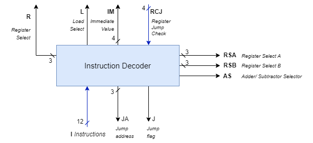

# Instruction Decoder

We need to design and build the Instruction Decoder circuit to activate
necessary components based on the instructions we wish to execute.

**Be careful to activate only the necessary modules** 
- While executing MOVI instruction only the required register should be enabled, and the immediate value needs to be placed on the data bus. 
- For ADD and NEG instructions, relevant inputs should be selected from the multiplexers and output should be sent to the correct register (register needs to be enabled). 
- Moreover, NEG require setting Add/Sub select.


## Inputs 
- `I(11 downto 0)` : Instruction (12 bits) 🔟
- `RCJ(3 downto 0)` : Register check for Jump (4 bits) 🏴

## Outputs
- `R(2 downto 0)` : Register enable (3 bits) 🔢
<!-- - 2 Register select (3 bits) -->
- `RSA(2 downto 0)` : Register select A (3 bits) 🔢
- `RSB(2 downto 0)` : Register select B (3 bits) 🔢
  
**`Register Select A` or `B` will have the same value as of `Register enable` because the value for the MUX will be selected from the enabled register**

<!-- - Add/Sub select (1 bit) -->
- `AS` : Add/Sub select (1 bit) 🏴
- `M`
- `L` : Load select (1 bit) `0 -> Immediate value, 1 -> Multiplexer output`
<!-- - Immediate value (4 bit) -->
- `IM(3 downto 0)` : Immediate value (4 bits) 🔟


<!-- - Jump flag (1 bit) -->
- `J` : Jump flag (1 bit) 🚩
<!-- - Jump address (3 bits) -->
- `JA(2 downto 0)` : Jump address (3 bits) 🏠




### OP Code for Instructions

Decode the instruction based on the following OP codes:
- `MOVI` : `10`
- `ADD` : `00`
- `NEG` : `01`
- `JMP` : `11`

## Execute cycles for each instruction

```vhdl
-- default flag values
J <= '0'
-- common output
R <= "000"
```

#### MOVI

> `Fetch > Decode > Execute `

```vhdl
IM <= I(3 downto 0)
L <= '1'
```

#### ADD

>` Fetch > Decode >` `Operand >` `Operand >` 

```vhdl
R <- I(9 downto 7)
RSA <- I(6 downto 4)
RSB <- I(3 downto 1)
AS <- '0'
L <- '0'
```
> `Execute`
```vhdl
R <- I(9 downto 7)
```
#### NEG

> `Fetch > Decode > Operand > Operand >` 

```vhdl
R <- I(9 downto 7) -- Specify the register to store the result
RSA <- "000" -- Select Reg0
RSB <- I(9 downto 7) --Specify the register to be negated
AS <- '1' -- Subtraction
L <- '0' -- Load
M <- '1' -- Multiplexer select
```

#### JZR R, d
Jump to d if value in register R is 0

> `Fetch > Decode > Operand > Execute`

```vhdl
J <- '1'
JA <- I(3 downto 1) -- This value is only used if the jump flag is set to 1
```


 